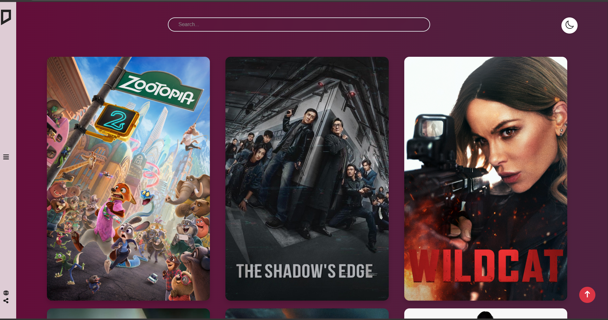
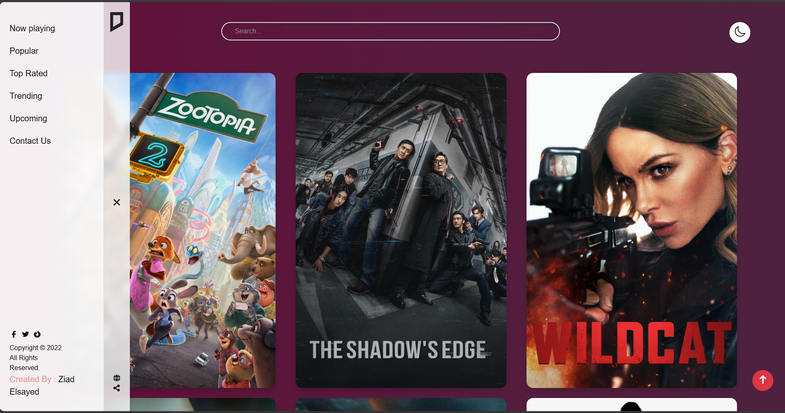
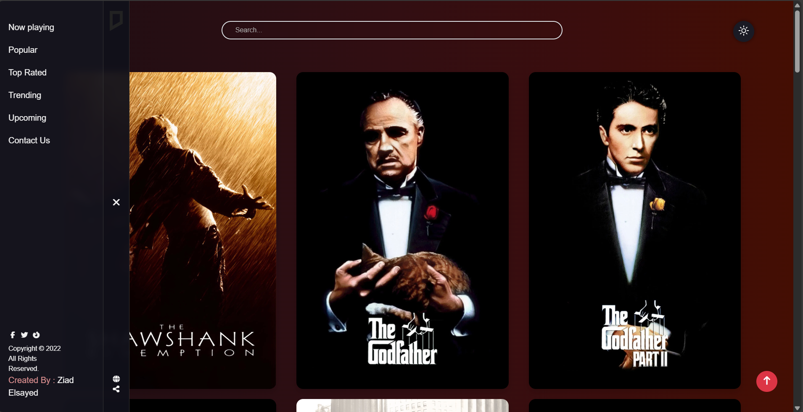
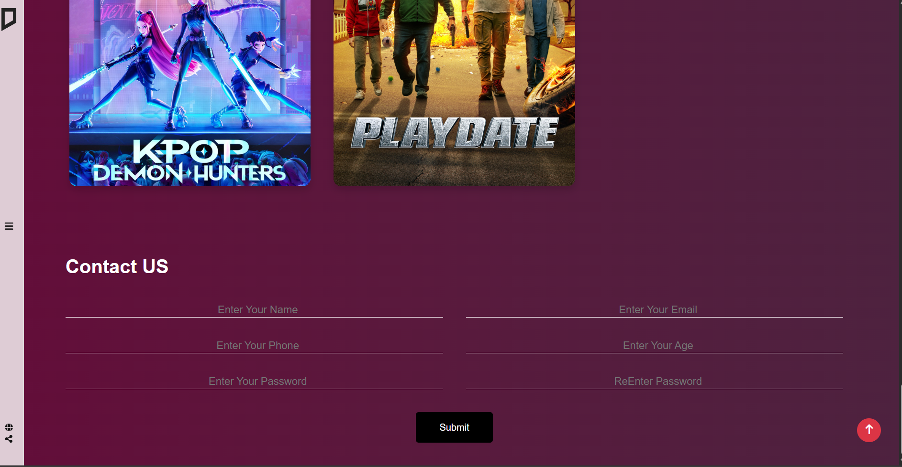
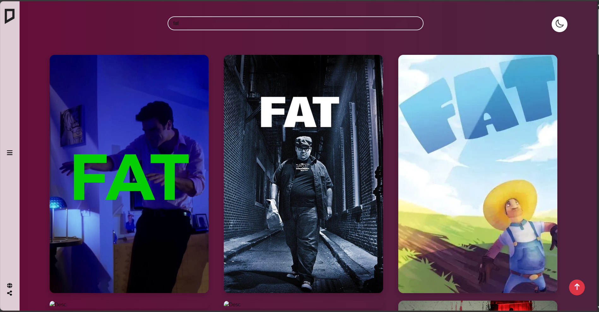
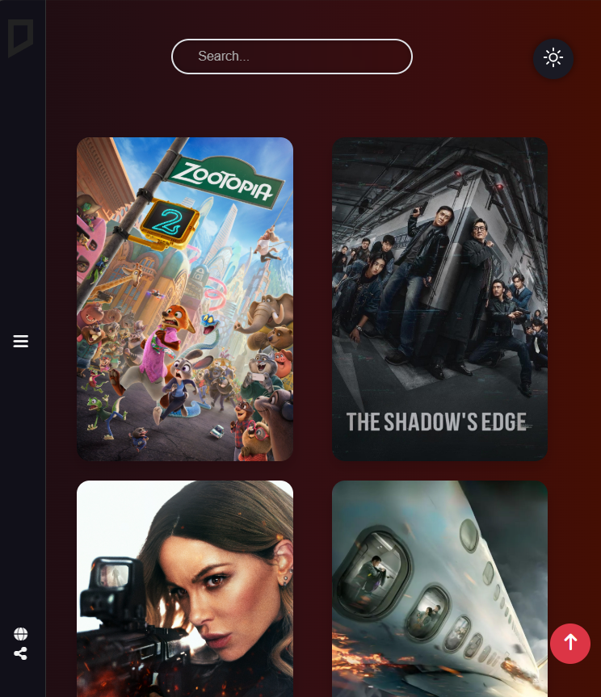
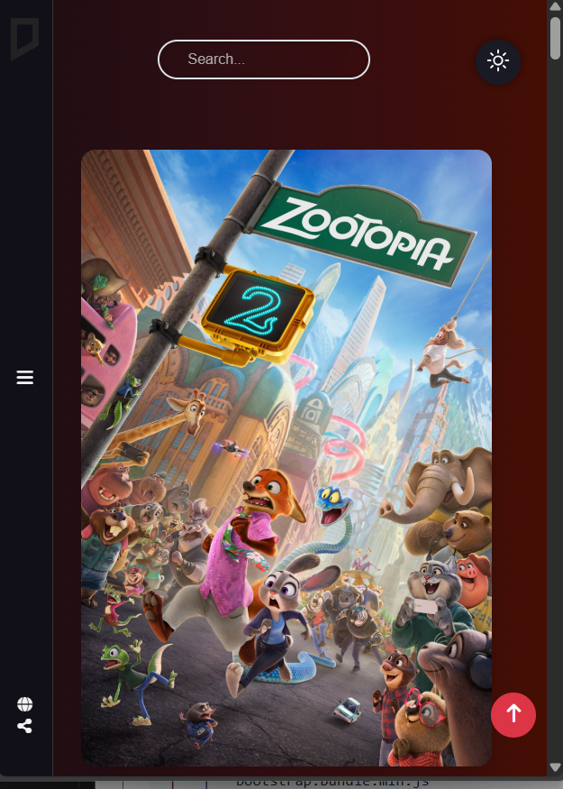

# 🎬 Movie App

تطبيق ويب لعرض تفاصيل الأفلام، البحث عنها، ومشاهدة تقييماتها بطريقة بسيطة وسهلة الاستخدام.
المشروع معمول باستخدام **HTML, CSS, JavaScript** مع استهلاك Movie API لعرض الداتا بشكل ديناميكي.

---


## 🚀 Features

* 🔍 **Search Movies**
  ابحث عن أي فيلم باستخدام الـ API.

* 🎞️ **Movie Details Page**
  عرض صورة الفيلم – القصة – السنة – التصنيف – النوع.

* ⭐ **Ratings & Popular Movies**
  عرض أشهر الأفلام أو أعلى التقييمات .

* 📱 **Responsive Design**
  متوافق مع كل الشاشات (موبايل / تابلت / كمبيوتر).
* 📱 **Dark Mode**
  وضع ليلى مريح للعين ومتناسق.

* ⚡ **Fast & Lightweight**
  استخدام Vanilla JS بدون مكتبات أو Frameworks.

---

## 🛠️ Tech Stack

* **HTML5**
* **CSS3**
* **JavaScript (ES6+)**
* **[The MovieDB API](https://developers.themoviedb.org/3/movies/get-movie-details)** أو أي API مستخدم

---

## 📦 Installation

```bash
# 1. حمل المشروع
git clone https://github.com/yourusername/movie-app.git

# 2. افتح الفولدر
cd movie-app

# 3. شغل المشروع
# افتح index.html في المتصفح مباشرة
```

---

## ⚙️ Configuration


```js
const API_KEY = "eba8b9a7199efdcb0ca1f96879b83c44";
```

---

## ▶️ Usage

1. افتح الموقع.
2. استخدم خانة البحث للعثور على فيلم.
3. اضغط على أي فيلم لعرض التفاصيل كاملة.
4. تصفح الأقسام (Popular – Top Rated) حسب اللي أنت عامله في مشروعك.

---


## 📁 Project Structure

```
MOVIE APP
│
├── index.html
│
├── Assets/
│   ├── images/
│   │   └── logo.png
│   │
│   ├── Style/
│   │   ├── all.min.css
│   │   ├── bootstrap.min.css
│   │   └── main.css
│   │
│   ├── webfonts/
│       ├── fa-brands-400.woff2
│       ├── fa-regular-400.woff2
│       ├── fa-solid-900.woff2
│       └── fa-v4compatibility.woff2
│
├── JS/
│   ├── bootstrap.bundle.min.js
│   └── main.js
│
└── .vscode/
```

---

## 📸 Screenshots


### 🏠 Home Page

> واجهة عرض الأفلام + البحث
> 
> 

---
### Navbar


> 
> 

---

### Contact Page
 
> 

---


---

### 🔍 Search Results

> عرض نتائج البحث حسب اسم الفيلم
> 

---

### 📱 Tablet Responsive View

> شكل التطبيق على التابلت
> 


### 📱 Mobile Responsive View

> شكل التطبيق على الموبايل
> 


---


## 📄 License

This project is licensed under the MIT License.

---

## 👤 Author

**Ziad El-sayed**
GitHub: [https://github.com/Ziad-AboElenien](https://github.com/Ziad-AboElenien)

Email: [ziadelsayed202201590@gmail.com](mailto:ziadelsayed202201590@gmail.com)


